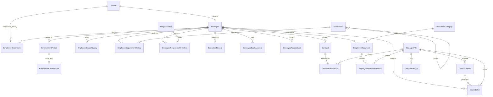

# طراحی پایگاه داده

## اصول

SQLite foreign keys and WAL are enabled. EF Core 10 migrations define the schema. Every entity has a focused `IEntityTypeConfiguration<T>`. `long` is the internal key type. Business dates use ISO `yyyy-MM-dd` text converters; technical timestamps are UTC. Original Persian display text is retained while normalized search columns on Person, Employee, Department and Responsibility make SQLite-side search deterministic.

## ER diagram

## Tables

The initial migration creates: `Persons`, `Employees`, `EmployeeDependents`, `EmploymentPeriods`, `EmploymentTerminations`, `EmployeeStatusHistories`, `Departments`, `EmployeeDepartmentHistories`, `Responsibilities`, `EmployeeResponsibilityHistories`, `EducationRecords`, `EmployeeBankAccounts`, `EmployeeAccessCards`, `Contracts`, `ManagedFiles`, `DocumentCategories`, `EmployeeDocuments`, `EmployeeDocumentVersions`, `ContractAttachments`, `CompanyProfiles`, `AppSettings`, `AuditLogs`, `BackupHistories`, `LetterTemplates`, and `IssuedLetters`.

The columns match the approved model. Technical refinements are explicit nullable `EndDate` columns for active-history partial indexes, normalized search columns (`NormalizedFirstName`, `NormalizedLastName`, `NormalizedPersonnelNumber`, `NormalizedMobileNumber`, `NormalizedName`, `NormalizedTitle`), and a singleton key check for `CompanyProfile.Id = 1`.

## Constraints and indexes

- Unique: `Persons.NationalCode`, `Employees.PersonId`, `Employees.PersonnelNumber`, non-null bank `CardNumber` and `Iban`, and `AppSettings.Key`.
- Partial unique: open employment period per employee, current status, active department, active primary responsibility, active primary bank account, active access card per employee, active access-card number, and current document version.
- One-to-one: termination per employment period and singleton company profile.
- Search indexes: normalized person names, personnel number, national code, mobile number, status, department, responsibility, contract type and soft-delete state.
- Range indexes: start/end pairs for employment, status, department, responsibility, access card and contract histories.

SQLite cannot reliably express overlap, required-primary-among-active, hierarchy-cycle and conditional gender/military rules using portable constraints. Application services enforce them transactionally and tests cover them. Unique-constraint violations are translated to typed Persian failures.

## Seed data

Only seven system document categories are seeded with stable identifiers: national card, birth certificate, education, contract, insurance, military service and other. No Person or Employee is seeded.
